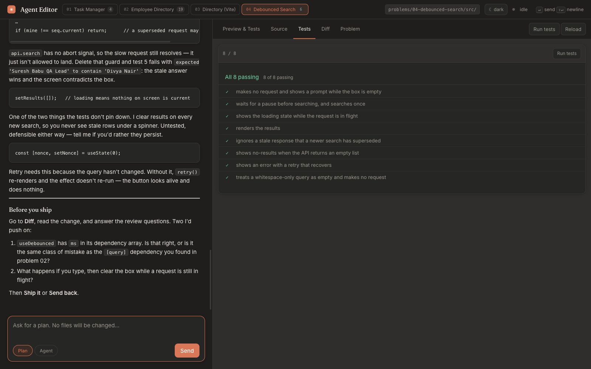
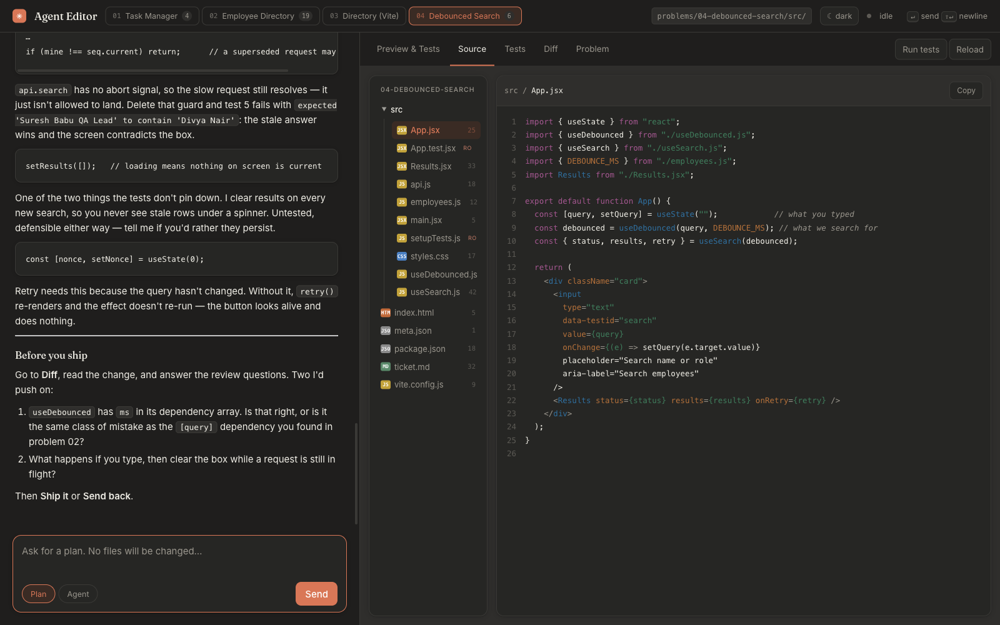

# agent-drill

A local harness for practising **AI-assisted coding interviews** — the format where
you don't type the solution, you direct an agent to write it and are judged on how
well you direct and review.

It runs entirely on your machine: a Python stdlib server, a browser UI, and a folder
of problems. No account, no service, no telemetry.




## Why

The interview format changed before the practice material did. In an AI-assisted
pad, the coding is the easy half. What actually separates people is judgement:

- noticing the ticket and the tests disagree, and knowing the tests win
- making the agent state a decision **before** it writes code
- spotting the bug the suite structurally cannot catch
- refusing to call it done because the tests are green

You can't drill that against a chat window, because a chat window has no oracle.
This has one: every problem ships with a read-only test suite that decides when
you're finished.

## The loop

```
plan  →  review the plan  →  agent  →  run  →  review the diff  →  ship / send back
```

Four things enforce it rather than suggest it:

| | |
|---|---|
| **Guarded plan mode** | In plan mode the workspace file is `chmod 444`. An agent that tries to edit gets `PermissionError`, not a reminder it can talk itself out of. |
| **Diff tab** | Git-backed. Uncommitted changes, or the last commit touching this problem, with a history rail. You review the change, not the file. |
| **Review gate** | Three standing questions, then Ship / Send back. **Ship is disabled until the suite is green**, and verdicts are recorded against the commit sha. |
| **Read-only specs** | `App.test.jsx` is marked RO in the explorer and is the spec. The ticket is a hint, and is sometimes wrong on purpose. |



## Problems

Two formats, both supported:

- **Single-file** — one `app.html` with React from a CDN and an in-browser test
  harness. Zero install, instant.
- **Vite** — a real npm project: Vite 5, Vitest 2, testing-library, multi-file
  `src/`. Built to `dist/` and served by the harness; tests run through
  `vitest --reporter=json` and render per-case in the Tests pane.

Thirty-one problems, graded easy → hard:

| # | Problem | Level | Tests |
|---|---|---|---|
| 01 | Task Manager | easy | 0 |
| 07 | Counter with Step | easy | 7 |
| 08 | Star Rating | easy | 6 |
| 09 | Accordion | easy | 5 |
| 11 | Password Field | easy | 6 |
| 12 | Tabs with Keyboard | easy | 6 |
| 13 | Character Counter | easy | 6 |
| 17 | Select All | easy | 6 |
| 18 | Pagination Hook | easy | 6 |
| 23 | Search Highlight | easy | 8 |
| 24 | Toast Queue | easy | 7 |
| 02 | Employee Directory | medium | 0 |
| 03 | Directory Table | medium | 9 |
| 05 | Leave Form (TS) | medium | 9 |
| 10 | Cart Totals | medium | 8 |
| 14 | Sortable Table | medium | 8 |
| 15 | Delete with Undo | medium | 5 |
| 19 | Modal Focus Trap | medium | 6 |
| 20 | Currency Input | medium | 8 |
| 21 | Filter Chips | medium | 9 |
| 25 | Dependent Selects | medium | 7 |
| 26 | Date Range | medium | 11 |
| 27 | Form Wizard | medium | 6 |
| 28 | Expandable Tree | medium | 6 |
| 04 | Debounced Search | hard | 8 |
| 06 | Optimistic Approvals | hard | 6 |
| 16 | Poll Until Done | hard | 6 |
| 22 | Retry with Backoff | hard | 7 |
| 29 | Virtual Window | hard | 8 |
| 30 | Stale While Revalidate | hard | 7 |
| 31 | Next.js Leave API | hard | 10 |

Each ships with a deliberate trap. Problem 02's ticket specifies an error message
the tests contradict; problem 04's ticket says nothing about concurrent requests,
and the test that matters is exactly about that.

## Quick start

```bash
git clone <this repo> && cd agent-drill
npm install          # one shared node_modules for every Vite problem
python3 server.py    # → http://localhost:8899
```

Python 3.8+ and Node 20.19+ (or 22.12+). The shell itself has no Python
dependencies — `http.server`, `json`, `fcntl`, `subprocess`.

## Bring your own agent

The harness is the rig. **What drives it is up to you** — there is no SDK, no API
key, and nothing to sign up for. Anything that can run a shell command can be the
agent: Claude Code, Cursor, Aider, Copilot CLI, a script against an API, a local
model, or you by hand.

The contract is three commands:

```bash
python3 next.py --wait      # block until a prompt arrives, then print it
                            # …do what it says…
python3 say.py agent --problem 04-debounced-search < reply.md
```

`next.py` prints the mode, the prompt, recent history, the last test result, and
every file in the problem with the read-only spec marked — then tells you the
exact reply command. `--json` for the machine-readable version.

To point a coding agent at it, give it the standing instruction in
**[OPERATOR.md](OPERATOR.md)** and leave it running. That is how this harness was
built: an agent in one window, the editor in a browser, no API key anywhere.

### Option: a local model

If you'd rather run it unattended against a local model, `agent.py` does that
loop for you over the OpenAI-compatible `/chat/completions` shape, so Ollama,
LM Studio and llama.cpp all work unchanged.

```bash
ollama serve & ; ollama pull qwen2.5-coder:7b
python3 agent.py
```

```bash
AGENT_BASE_URL=http://localhost:11434/v1   # default
AGENT_MODEL=qwen2.5-coder:7b               # default
```

> **Status:** `agent.py`'s block parser and write guards are unit-tested, but it
> has not been exercised end to end against a live model. The harness does not
> depend on it.

In agent mode a model returns whole files in fenced blocks tagged with a path:

````
```jsx path=src/App.jsx
...whole file...
```
````

The runner refuses to write a READ ONLY spec, rejects any path containing `..` or
a leading `/`, and in plan mode the `chmod 444` guard makes the write fail anyway
— three independent checks, because a model that is wrong about code will
occasionally be wrong about paths.

## A small local model is a feature here

A 7B model will not solve these problems cleanly. It will produce plausible React
with a stale dependency array, an index used as a key, a missing guard.

That is the point. The skill being drilled is **reviewing agent output**, and a
weaker agent generates more of the defects worth catching. Use a frontier model
when you want the answer; use a small local one when you want the practice.

## Other frameworks and languages

Nothing in the harness is React-specific. A problem is a folder with a
`package.json`, a `build` script, a `test` script that writes vitest's JSON
reporter output to `result.json`, and a `meta.json`. That is the whole contract.

Problem 31 is a **Next.js** app rather than Vite, and needed no harness change
beyond one line of metadata — `"outDir": "out"`, because Next exports there
instead of `dist/`. Its route handler is tested directly as a function, since
an App Router handler is just `Request → Response`.

The same shape would take Vue, Svelte or Solid: swap the framework, keep the
`build` and `test` scripts.

**Beyond JavaScript** is a bigger lift and is not done. The server shells out to
`npm`, and the Tests pane parses vitest's JSON. A Python or Go track would need
a per-problem runner command in `meta.json` and a small adapter mapping that
runner's output to `{ passed, total, cases[] }`. Contributions welcome — the
seam is `npm()` and `vitest_summary()` in `server.py`, about thirty lines.

## Adding a problem

Drop a folder into `problems/`. It appears in the switcher on the next poll — no
code change, no restart.

```
problems/05-your-problem/
  meta.json      {"title": "Your Problem", "kind": "vite"}
  ticket.md      what the candidate reads
  package.json   name it p05-…, and npm install at the root
  src/           your stubs + a read-only *.test.jsx
```

For a single-file problem, use `{"kind": "single"}` and one `app.html` with
`/* === … === */` banner comments — the Source tab uses them as regions.

## How it's wired

```
server.py    stdlib HTTP on 127.0.0.1 with a Host allowlist, flock'd atomic
             state writes, git + npm shelling out, path-escape guards
ui.html      one file: chat, explorer, diff, tests, review gate, theming
say.py       how the agent posts a reply into a problem's history
state.json   per-problem message history, test results, review verdicts
problems/    one folder per problem
```

The preview iframe is sandboxed without `allow-same-origin`, so it has an opaque
origin: it can't reach the server directly and reports its results by posting up
to the parent. Vite's `crossorigin` module scripts need CORS headers on
`/preview/*` for the same reason.

## Not built, on purpose

Session playback, activity timelines, screen observation, PDF reports. Those exist
so an interviewer can audit a candidate afterwards. Practising alone, they're
theatre.

## Credit

The format is modelled on HackerRank's AI-assisted interviews and CodePair.
Not affiliated with or endorsed by HackerRank; no HackerRank content is included.
Every problem here is original.

## Licence

MIT
